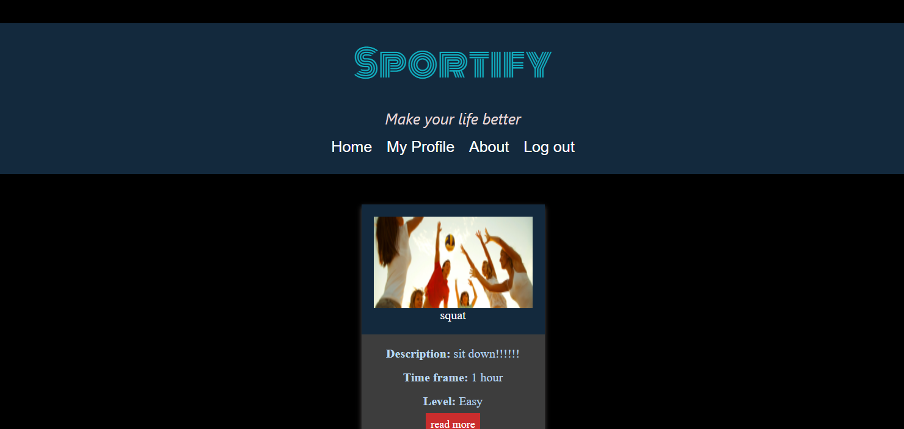

# Sportify

## Table of Contents

1. [Description](#description)
1. [Link to deployed app](https://calm-shelf-72649.herokuapp.com/login)
1. [Visual](#visual)
1. [Creators](#creators)

# Description

This is an application for people who loves fitness and sports and looking for an individual workout plan.
User will be able to signup/login to the app. And once the users logged in they are presented with workout options, they will be able to view the workout plan and save it to their profile page. The user can leave comments on each work. On the profile page they are going to be presented with a list of saving workouts and the form where the can create their own workout.

# [link](https://calm-shelf-72649.herokuapp.com/login) to deployed app 

# Visual

# Creators

[Seth Wooten](https://github.com/slwooten)

[Jan Carlos Dominguez](https://github.com/JanInquisitor)

[Anastasiia Ciloci](https://github.com/Anastasiia-Ciloci)
